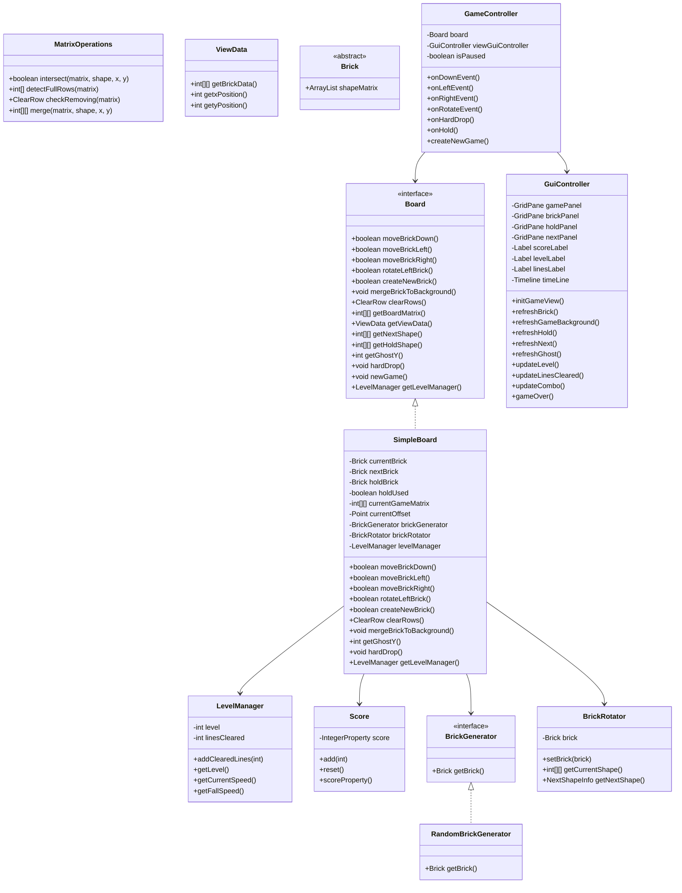
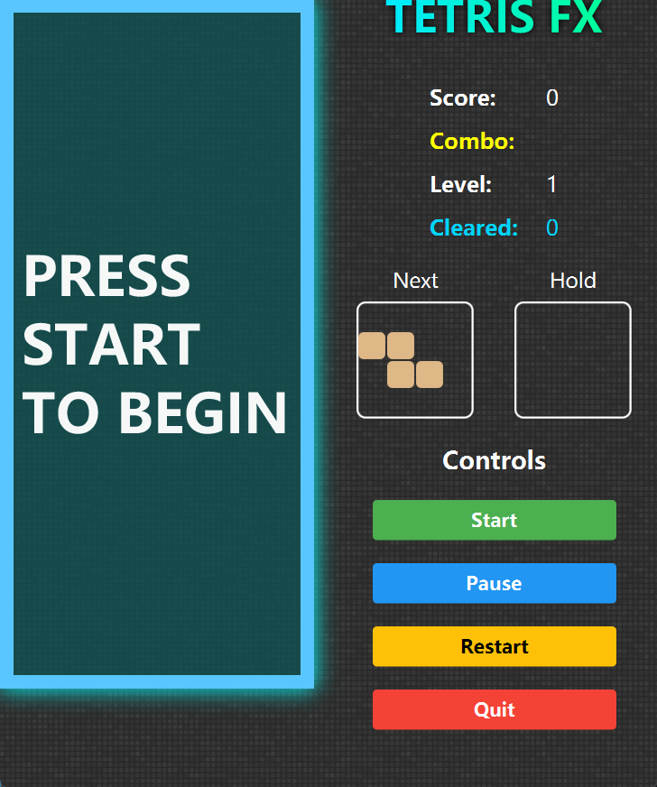
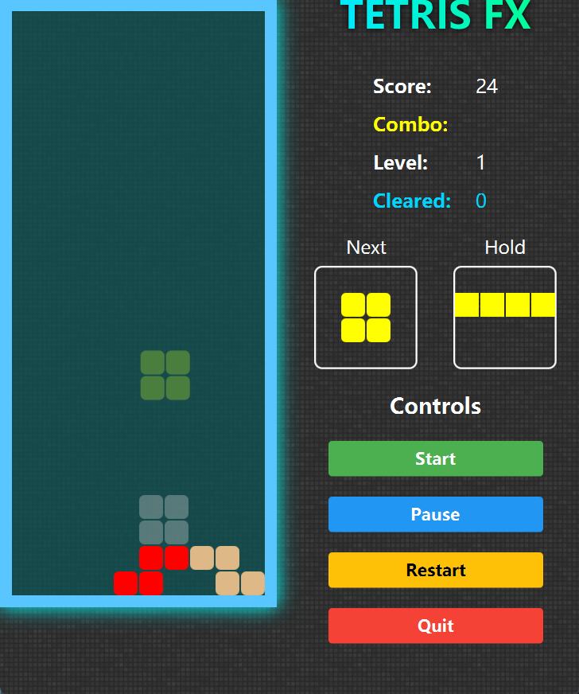
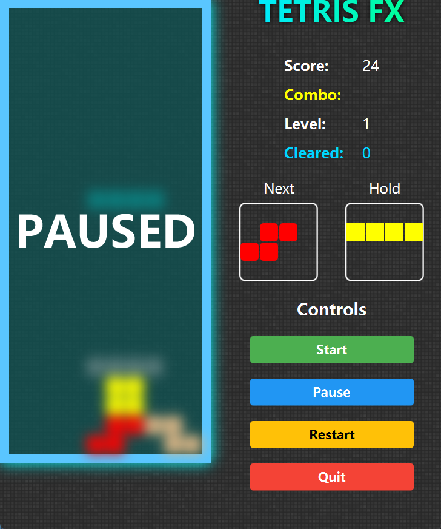
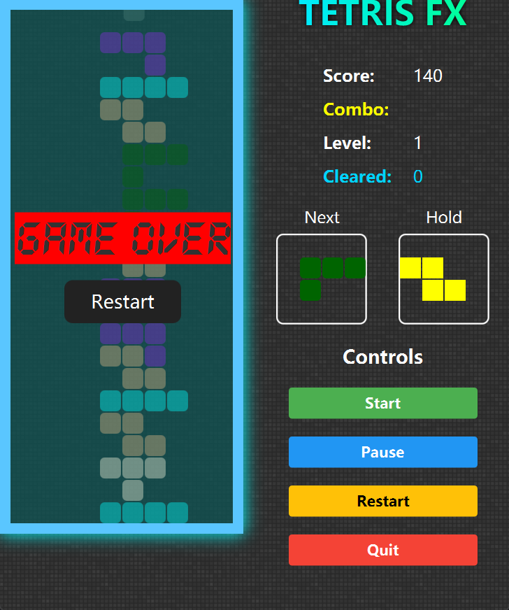

🌟 Tetris FX — COMP2042 Coursework
1. Overview

Tetris FX is a fully refactored and enhanced version of the COMP2042 Tetris coursework, built with JavaFX and modern software engineering principles.
The project demonstrates:

Clean architecture

Strong separation of concerns

Meaningful gameplay improvements

Feature extensions

Comprehensive unit testing

This submission goes significantly beyond the original template, delivering a polished and maintainable Tetris implementation.
2. Refactoring Summary (Key Changes)

This coursework required significant restructuring of the original codebase.
The refactoring focused on improving architecture, readability, modularity, and maintainability.

2.1 Meaningful Package Organisation

The project was reorganised into clear, logical modules:
com.comp2042.logic
com.comp2042.logic.bricks
com.comp2042.logic.level
com.comp2042.logic.events
com.comp2042.ui
This makes responsibilities explicit and simplifies navigation.

2.2 MVC Architecture & Separation of Concerns

The redesigned structure follows the Model–View–Controller pattern:

| Component                       | Responsibility                                                            |
| ------------------------------- | -------------------------------------------------------------------------- |
| **SimpleBoard (Model)**        | Board rules, movement, collision detection, ghost logic, row clearing, hold system |
| **GameController (Controller)** | Translates user input into actions, updates the model, manages game flow   |
| **GuiController (View)**        | Rendering, animations, UI layout, event handling                           |

All gameplay logic originally located inside `GuiController` was fully removed and relocated  
into `GameController` and `SimpleBoard`.  
This is a major part of the refactoring mark.

2.3 LevelManager (New Class Extraction)

A dedicated LevelManager class was introduced to handle:

Level progression
Tracking cleared lines
Calculating fall speed (ms)
Timeline rate scaling
This improves single-responsibility and makes the game easier to extend.

2.4 Removal of Dead Code and Redundant Logic

Unused or duplicated classes and logic were removed, including:

Legacy ClearRow and DownData structures
Old UI-driven movement and speed logic
Outdated collision methods
Redundant fields and unused resources
The result is a cleaner and more maintainable codebase.

2.5 Encapsulation & Code Quality Improvements

Improved naming conventions
Eliminated direct field access
Added getters where appropriate
Simplified branching and movement logic
Replaced UI logic embedded in the model
These changes enhance readability and reduce coupling.

2.6 Major Bug Fixes

Refactoring also corrected several functional issues:

Ghost piece aligning incorrectly
Hold mechanic allowing infinite swapping
Level never increasing / speed never updating
Timeline not syncing with level speed
Incorrect board width/height matrix
Flash animation inconsistencies
Clear-row detection errors

3. Additions (New & Enhanced Gameplay Features)

The game has been substantially improved with meaningful and innovative additions.

3.1 New Playable Levels

Level increases every ten cleared lines
Fall speed scales dynamically
Timeline speed adjusts automatically
Level displayed in the UI

3.2 Gameplay Enhancements

Combo multiplier system
Floating score animation (e.g., “+650”)
Clear-row flash animation
Smooth brick movement
Neon-glow styled UI
Faster-paced gameplay at higher levels

3.3 Innovative Features

Ghost piece showing landing position
Hold system (once per turn)
Pause overlay with Gaussian blur
“Press Start” fade animation
Background music loop (BGM)
These features make the game distinct and demonstrate creativity beyond the base requirements.

4. JUnit Tests

A suite of meaningful and targeted unit tests was added to ensure the correctness of the game logic.

Included Tests:

| Test Class                  | Purpose                                   |
| --------------------------- | ----------------------------------------- |
| **LevelManagerTest**        | Tests level progression and dynamic speed |
| **ScoreTest**               | Tests scoring and resetting               |
| **MatrixOperationsTest**    | Collision, merging, and row detection     |
| **SimpleBoardMovementTest** | Movement and wall/collision constraints   |
| **SimpleBoardClearRowTest** | Row clearing and board updates            |
| **SimpleBoardHoldTest**     | Hold functionality and restrictions       |

These tests validate model behaviour independently of the UI, supporting long-term maintainability.

5. UML Class Diagram

6. How to Run the Game

Requirements

JDK 17 or later
JavaFX 17+
Maven (optional, project works with IntelliJ JavaFX plugin)

Run in IntelliJ IDEA

Ensure JavaFX SDK is configured
Open the project folder
Run Main.java

Run via Maven

mvn javafx:run

7. Screenshots

Below are key UI screens showcasing the enhanced TetrisFX gameplay experience.

---

### 🎮 Start Screen

A clean neon-style start screen with a blinking “Press Start to Begin” message.

---

### 📦 Hold Feature

The Hold system lets the player store a piece and swap it once per turn.  
The Hold panel updates instantly when a piece is stored.

---

### ⏸️ Pause Screen

Pause mode applies a soft **Gaussian blur** to the background and displays  
a centered **PAUSED** message with a smooth fade-in animation.

---

### 💀 Game Over Screen

The game ends with a dimmed background and a fade-in **Game Over** panel  
showing Restart and Quit options.

8. Conclusion

This project demonstrates:

High-quality refactoring
Clean separation of concerns
Meaningful gameplay enhancements
Robust and maintainable architecture
Comprehensive unit testing

The final result is a polished and modernised version of Tetris that goes significantly beyond the original coursework template.
